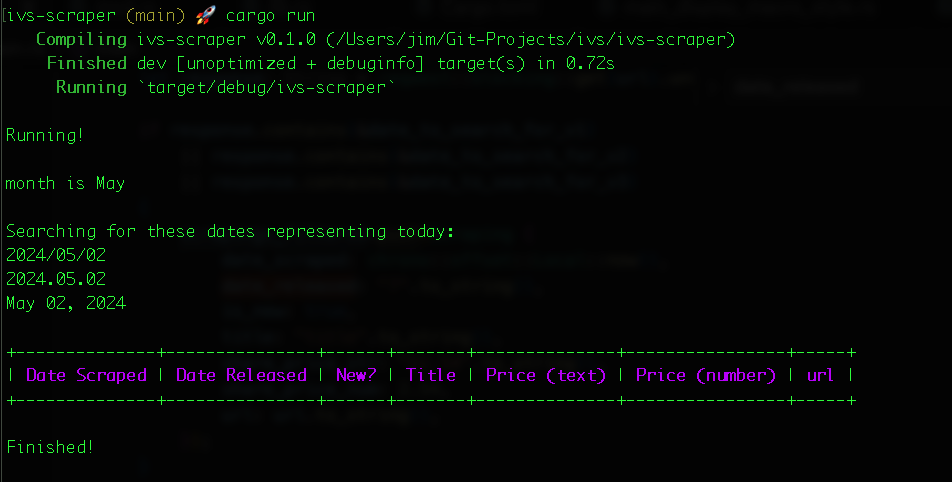

# ivs
investor relations scraper

 

### Output Example

 

### Running The Code

(assumes you have rust compiler and cargo already installed)

1) clone this repository (or just download the files)

2) navigate into the _ivs-scraper_ folder in your command line.

3) run this command: `cargo run`